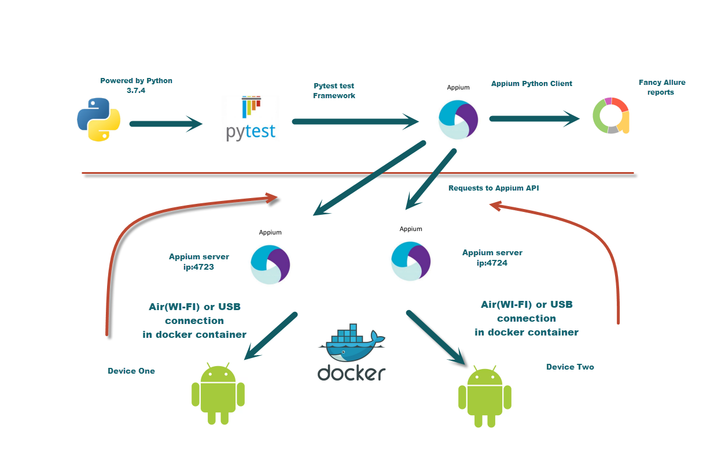

# Slickdeals - Android - Automation
### In order to run for 2 or more devices MAC OS required.
### Frameworks: Python/Pytest/Docker/Appium/apllure

1. Download Python 3.7.4 https://www.python.org/downloads/ 

2. Install Brew. Paste that in a macOS Terminal prompt. 
    ###
        /usr/bin/ruby -e "$(curl -fsSL https://raw.githubusercontent.com/Homebrew/install/master/install)" 
3. Install Allure. Paste that in a macOS Terminal prompt.
     ###
        brew install allure
4. Install Docker. https://docs.docker.com/docker-for-mac/install/

5. Pull Appium image https://hub.docker.com/r/appium/appium/ (reference) https://github.com/appium/appium-docker-android (reference)
     ###
        docker pull appium/appium 
6. Setting up Android real device test on Docker macOSX : Make sure you have latest docker installed on mac:
    ###
        $ docker-machine --version
        $ docker-machine version 0.10.0, build 76ed2a6
7. Create a docker-machine as follows:
    ###
        $ docker-machine create --driver virtualbox appium-test-machine
8. Enable USB in created docker-machine.
    ###
        $ docker-machine stop appium-test-machine
        $ vboxmanage modifyvm appium-test-machine --usb on --usbehci on
        $ docker-machine start appium-test-machine
    Note: You need to install Extension Pack depends on your virtualbox version, in case you get an Error "Implementation of the USB 2.0 controller not found"
9. Open Virtual box, move to appium-test-machine created, select USB and add Android device and Host Controller.
10. Remove your base machine's ownership over the Android device(s)
    ###
         adb kill-server
11. SSH into the docker machine created
    ###
         $ docker-machine ssh appium-test-machine
12. Run the docker images on the newly created docker machine 
    ###
            $ docker run --privileged -d -p 4723:4723  -v /dev/bus/usb:/dev/bus/usb --name container-appium appium/appium
            $ docker run --privileged -d -p 4724:4724  -v /dev/bus/usb:/dev/bus/usb --name container-appium2 appium/appium2

13. Run following command to verify adb devices can detect the connected android device.
    ###
        $ docker exec -it container-appium adb devices
        $ docker exec -it container-appium adb devices2
14. Connect Each Device to a Separate Container. 
    In certain use cases you may want to have a single Appium-Docker-Android container running for each device. To achieve this you must run adb kill-server and then provide the --device option to docker run:

    ###
        $ docker run -d -p 4723:4723 --device /dev/bus/usb/XXX/YYY:/dev/bus/usb/XXX/YYY -v ~/.android:/root/.android --name device1 appium/appium
        $ docker run -d -p 4724:4723 --device /dev/bus/usb/XXX/ZZZ:/dev/bus/usb/XXX/ZZZ -v ~/.android:/root/.android --name device2 appium/appium
15. Connect to Android devices by Air. Appium-Docker-Android can be connected with Android devices by Air. To do that you need to configure android device, according to official manual Then run docker container with following parameters:
       ###
            REMOTE_ADB=true
            ANDROID_DEVICES=<android_device_host>:<android_device_port> [,<android_device_host>:<android_device_port>]
            REMOTE_ADB_POLLING_SEC=60 (default: 5, interval between polling the list of connected devices in order to connect to lost remote devices)
16. Once you make sure that, devises is reachable from containers, you can run framework
    ###
         $ docker exec -it container-appium adb devices
         $ docker exec -it container-appium adb devices2
17. Make sure that http://localip:4723/wd/hub' and http://localip:4724/wd/hub' reachable from Chrome

18. Open config.py file and update:
    ###
        apppath = (path to app)
        desiredCapabilitiesAppiumFirstddevice and desiredCapabilitiesAppiumSeconddevice= device names from step 16
        urlFirstAppiumDockerServer and urlSecondAppiumDockerServer with ips from step 16.
19.For running Pytest Framework paste that in a macOS Terminal prompt from project directory. 
  ###
         py start.py 
         
20. Project structure:
#